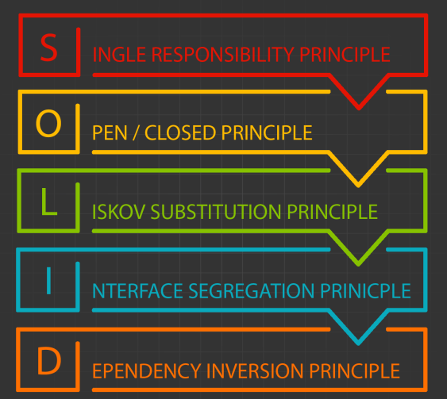
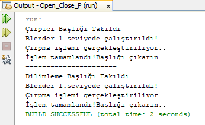
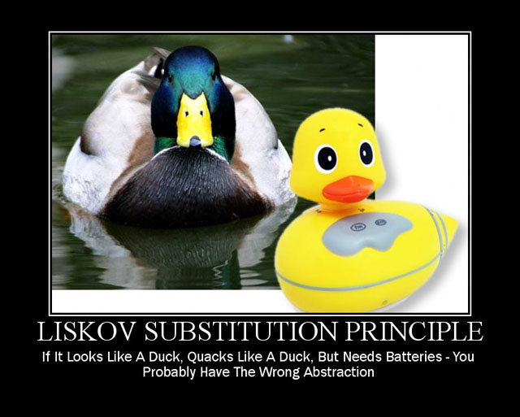
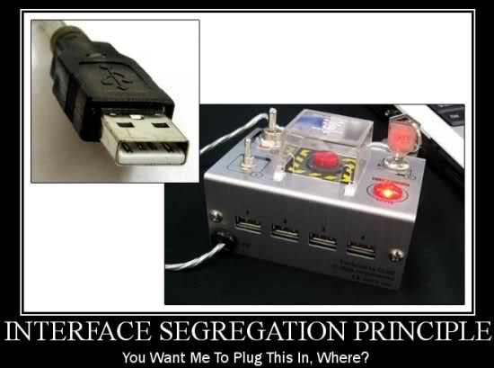
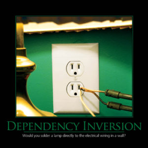

= S.O.L.İ.D PRENSİPLERİ

Robert Martin tarafından Nesneye Yönelik Programlamanın(Object Oriented Programming) ilk 5 maddesi olarak sunuldu. Bu prensiplerin asıl amacı yazdığımız programın gelecekte istenebilecek değişikliklere,yeniliklere karşı en az değişiklik ve zaman kaybı sağlanarak geliştirilmesi ve yeni bir özellik istendiğinde projede minimum değişiklik yapılarak gerçekleştirilsin düşüncesidir.

== Single Responsibility(Tek Sorumluluk) Prensibi

Single responsibility prensibi sınıflarımızın iyi tanımlanmış tek bir sorumluluğu olması gerektiğini anlatmaktadır. Bir sınıf (nesne) yalnızca bir amaç uğruna değiştirilebilir, o amaçta o sınıfa yüklenen sorumluluktur, yani bir sınıfın yapması gereken yalnızca bir işi olması gerekir.
Eğer geliştirdiğiniz sınıf ya da fonksiyon birden fazla amaca hizmet ediyorsa, bu kurala aykırı bir geliştirme sürecinde olduğunuz anlamına geliyor. Bunu farkettiğinizde amaçlara uygun olarak parçalamanız gerekmektedir.

Gereksinimler değiştiğinde, yazılan kodda da değişmesi gereken kısımlar olacaktır. Bu da yazılan sınıfların(nesnelerin) bir kısmının ya da tamamının değiştirilmesi anlamına gelir. Bir sınıf ne kadar fazla sorumluluk alırsa, o kadar fazla değişime uğramak zorunda kalır. Böylece birçok kod parçasının değişmesine neden olurken, yeniden yazımda; değişikliklerin uygulanması da bir o kadar zorlaşır.

> Sorumluluğun azaltılması demek değişime daha kolay adapte olmak demektir.

== OPEN-CLOSE (AÇIK-KAPALI) PRENSİBİ
Sınıfların/fonksiyonların değişikliğe kapalı ancak yeni davranışların eklenmesine açık olmalıdır. 

> Bu prensip; sürdürülebilir ve tekrar kullanılabilir yapıda kod yazmanın temelini oluşturur.
> -- Robert C. Martin

Open :: Sınıf için yeni davranışlar eklenebilmesini sağlar. Gereksinimler değiştiğinde, yeni gereksinimlerin karşılanabilmesi için bir sınıfa yeni veya farklı davranışlar eklenebilir olmasıdır.
Close:: Bir sınıf temel özelliklerinin değişimi ise mümkün olmamalıdır.

==== Projem Hakkında:

NOTE: Yaptığım proje, mutfaklarda sıklıkla kullanılan blender aletiyle ilgilidir. Blender aleti aslında motor yapısı olarak bütün sürümlerinde aynıdır. Farklı olarak ortaya çıkan şey başlık yapısı ve işlevidir. Buna değindiğim projede her başlık Command'den türer. Çırpıcı başlığını execute metoduyla öğrenebilirim. Seviyeler classı ile de blenderı çalıştırabilirim. 
[source,java]
----
    public interface Com {    // <1>

        public void execute();
    }
    static class BlenderCirp implements Com {       //<2>

        public BlenderCirp(){
            System.out.println("Çırpıcı Başlığı Takıldı");
        }
        public void execute(){
            System.out.println("Çırpma işlemi gerçekleştiriliyor..");
            
        }   
    }
    
    static class Seviyeler{     // <3>
        Com com;
        public Seviyeler(){
            
        }
        public void setCom(Com com){
            this.com=com;
        }
        public void calistir1(){                               
            System.out.println("Blender 1.seviyede çalıştırıldı!");
            com.execute();
            
        }
    }
----
<1> Her blender başlığı için bu interface çalıştırılacak ve her başlığın yapması gereken işlem gerçekleşecek.

<2> Burası her blendera göre değişiklik gösterir ve yeni başlıklar eklenebilir. Burası belirlenen başlığın yapacağı işlemi söyler.

<3> Bu alan tüm blenderlar için ortaktır ve değiştirilemez. Burası blenderın çalıştırılması için vardır.

WARNING: Ekran Çıktısı:

NOTE: Burada başlık classı ilk olarak taklın başlığın ekranda gösterilmesine sağlayan bir fonksiyon bulundurur. Daha sonra Seviye classında çalışır ve seçilne seviye ile birlikte blenderın aktif olarak çalıştığını söyler. Burada aynı zamanda başlığın çıkarılması gerektiğini söyleyen bir metot da vardır.

WARNING: UML:

image::Openc.png[]

== Liskov’s Subtitution(Liskov’un Yerine Geçme) Prensibi

> Aranan yer değiştirme özelliği şöyle tanımlanabilir: T cinsinden parametre alan tüm programlar (fonksiyonlar) P olacak şekilde, S tipinde o1 nesnesi ve T tipinde o2 nesnesi olsun. Eğer o1 ile o2 nesneleri yer değiştirdiğinde P’nin davranışı değişmiyorsa S tipi T tipinin alt tipidir!
> -- Barbara Liskov

LSP prensibi Open Closed prensibinin özel bir türüdür desek yanlış olmaz. OCP’de de olduğu gibi LSP de de genişlemeye açık yapılar söz konusudur. Her ne kadar anlaşılması biraz zor olsa da LSP ilk bakışta, altında yatan ana fikri: alt sınıflardan oluşan nesnelerin üst sınıfın nesneleri ile yer değiştirdikleri zaman, aynı davranışı sergilemesini beklemektir.

NOTE: Alt sınıflardan oluşan nesnelerin, üst sınıfın nesneleri ile yer değiştirdikleri zaman, aynı davranışı sergilemesi gerekmektedir.

== Interface Segregation(Arayüz Ayrım) Prensibi

Tek bir interface yerine kullanımlarına göre parçalanmış birden fazla interface ile işlemleri yürütmeliyiz. Yani her farklı sorumluluğun kendine özgü bir arayüzü olması gerekmektedir. Böylece interface’i kullanan kişide sadece ihtiyacı olanlarla ilgilenmiş olur. Birden fazla amaç için yalnızca bir arayüzümüz var ise buna gerektiğinden fazla method ya da özellik ekliyoruz demektir, bu da IS prensibine aykırı davrandığınız anlamına gelir..

> Nesneler asla ihtiyacı olmayan property/metot vs içeren interfaceleri implement etmeye zorlanmamalıdır.

Görüldüğü gibi single responsibility ve interface segregation prensipleri birbirine oldukça yakın ve aynı amaca hizmet eden prensiplerdir. Tek fark ise Interface segregation arayüz(interface)ler ile ilgilenirken, Single responsibility sınıflarla ilgilenmektedir.

Bir methodun IS prensibine uymayan interface’e eklenmesi veya bir method üzerindeki değişiklik, Bu interface’i kullanan(implement etmiş) tüm sınıfları değiştirmemizi gerektirir. Bir arayüz yazarken, farklı sorumlulukları ya da farklı davranış gruplarını her zaman farklı arayüzlere ayırmak önemlidir.

== Dependency Inversion(Bağımlılığın Ters Çevrilmesi) Prensibi

Yüksek seviye sınıflarda bir davranış değiştiğinde, alt seviye davranışların bu değişime uyum sağlaması gerekir. Ancak, düşük seviye sınıflarda bir davranış değiştiğinde, üst seviye sınıfların davranışında bir bozulma meydana gelmemelidir.

Sorunlardan kurtulmanın yolu ::

Dependency Inversion, yani üst sınıflar, alt seviyeli sınıflara bağlı olmamalı, çözüm ise her ikisi de soyut kavramlar üzerinden yönetilebilmelidir. Yüksek seviye ve düşük seviye sınıflar arasında bir soyutlama katmanı oluşturabiliriz.

